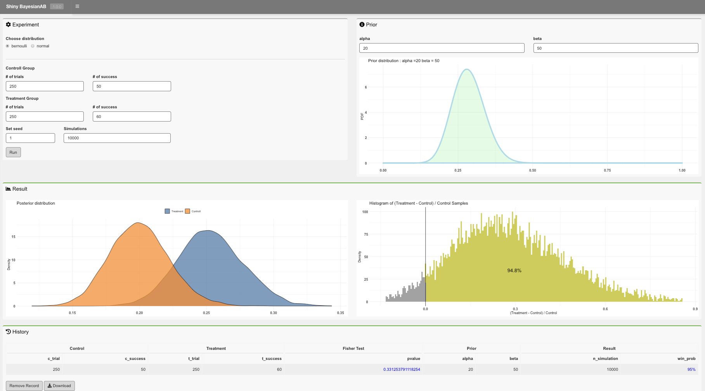

# ShinyBayesianAB
A shiny app for Bayesian A/B Testing.

In the context of A/B testing, bayesian A/B Testing is one of the representative methods showing a probability of how much A is better (or worse) than B based on bayesian inference.
The shiny app serves simple UI to fill in necessary parameters for bayesian A/B testing, informative visualization, and summary table to understand results.

The implementation is based on `bayesAB` package built and maintained by Frank Portman.

https://okiyuki.shinyapps.io/ShinyBayesianAB/

## Preview

## RStudio Cloud Project Link
* https://rstudio.cloud/project/1082642

## Reference
* [BigTimeStats/Bayesian-AB-Testing-Shiny-App](https://github.com/BigTimeStats/Bayesian-AB-Testing-Shiny-App)
* [Introduction to bayesAB](https://cran.r-project.org/web/packages/bayesAB/vignettes/introduction.html)
